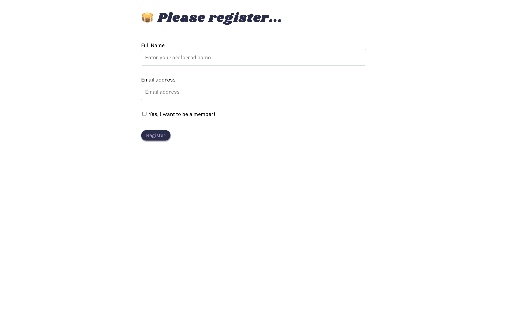
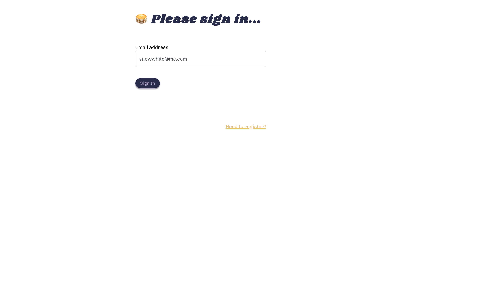
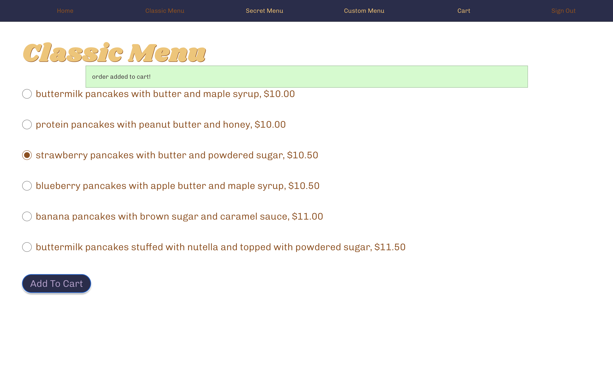
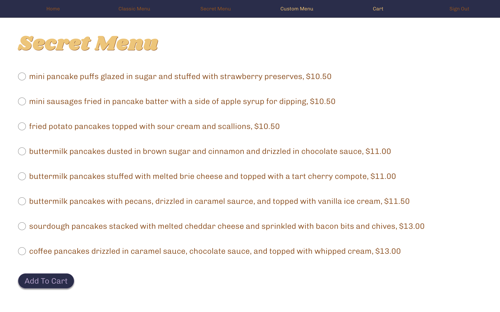
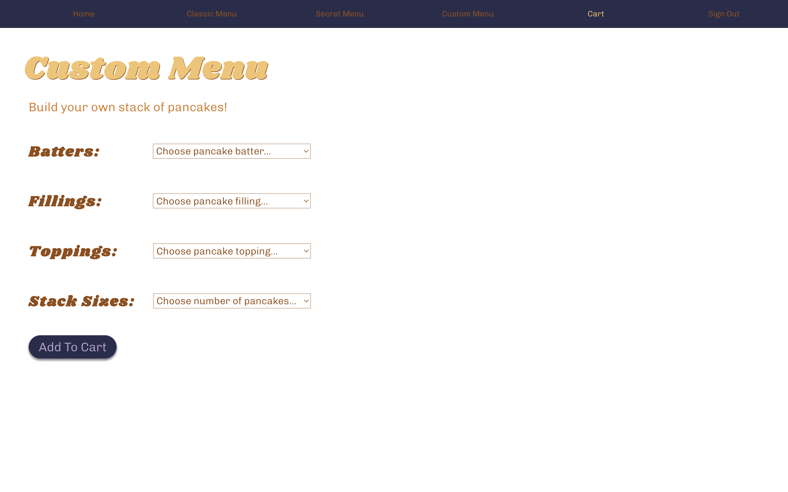
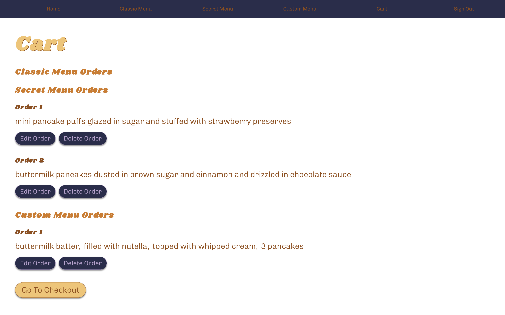
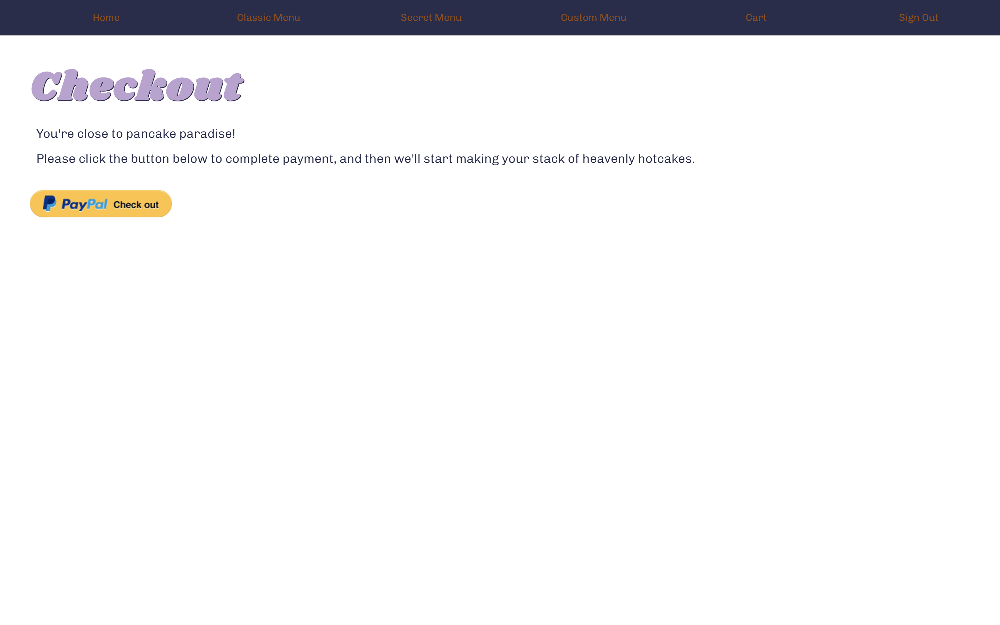

# Hello, Hotcakes!

   Hi! This is my first front-end web development project. The main goal was to practice and challenge the *software development* skills I learned at Nashville Software School. 

# Overview 

   "Hello, Hotcakes!" is a CRUD app themed after restaraunt websites with online food ordering service. 
   
   The app allows for two types of users, "guests" and "members". Users can sign into the app as either type. As a guest, users can order food from two menu forms. As a member, users can order food from a third, secret menu. 
   
   All users can see their orders in a cart. When viewing the cart, users can edit and delete orders. When ready, users can go to checkout. 

# Demo 

   https://www.loom.com/share/dcbc0dcfe53e44d38d6bf76148e540c2    

# Goals 

   + make an application that creates, reads, updates, and deletes data
   + strengthen algorithmic thinking 
   + gain more expereince with managing complex data relationships 
   + learn how to build and use form fields 
   + use a third-party database to store, create, and delete data
   + gain more experience with styling by applying custom css 

# Challenges Faced 

   + changing plans and stategies in the middle of the project
   + refactoring code to adapt to changed plans 
   + mangaing many complex data relationships at once 
   + ensuring the edit function works consistently 
   + accurately testing features to make sure they're functioning as expected
   + debugging! 

# Lessons Learned 

   + keep it simple 
   + meet mvp as fast as possible
   + know when to ask for help
   + test your code frequently
   + not only is self-care essential, but it will help you think better 
   + when in doubt, think how far you've come
   + remember, you got this! trust yourself

# How was the application developed?

   The programming langauges featured are React Javascript, CSS, and HTML. 

    

# What tools did you use to plan for your application? 

Entity Relationship Diagram (ERD): 
https://dbdiagram.io/d/6386c107bae3ed7c4543abd4

Wireframe: 
https://www.figma.com/file/3KaVAbAF8qg009Y41jtdLR/Hello%2C-Hotcakes!-wireframe?type=design&node-id=0%3A1&mode=design&t=9YSqKZWQj0vRdSsU-1 

# Screenshots

Registration Page: 
 

Sign-In Page: 
 

Guest Home Page: 
 

Member Home Page: 
 

Classic Menu Page: 
 

Secret Menu Page: 
 

Custom Menu Page: 
 

Cart Page: 
 

Checkout Page: 
  

# How to install and run the application 
   
   The application uses two repositories, "hello-hotcakes" and "hello-hotcakes-api", and runs using React. The "hello-hotcakes" repository holds the project module/component code. The "hello-hotcakes-api" repository holds the API database module. The app is optimized for desktop. 

   **FIRST**, users should PULL the repositories from GitHub. Please see below for links. 

   https://github.com/pancakes-because/hello-hotcakes 

   https://github.com/pancakes-because/hello-hotcakes-api 
   
   **SECOND**, users should complete the following package installations in order for the application to run. Users should be inside the "hello-hotcakes" directory before starting this process. Once inside the directory, users will run the following command to install React in their terminal, `npm install --save react-router-dom`. 

   **THIRD**, users may run the following command in their terminal, `npm start`, when they are ready to run the application. The browser will open the http://localhost:xxxx URL automatically. When successful, the message below will dispaly in the terminal. 

    " Compiled successfully!

      You can now view hello-hotcakes in the browser.

      Local:            http://localhost:xxxx
      On Your Network:  http://xxx.xx.xx.xxx:localhost#

      Note that the development build is not optimized.
      To create a production build, use npm run build.

      webpack compiled successfully " 

   **FOURTH**, users will open a NEW terminal window or tab to run the API in the background. Users should be inside the "hello-hotcakes-api" directory. Users will then enter this command in the terminal, `json-server -p 8088 database.json`. When successful, the message below will display in the second terminal window/tab. 

      " \{^_^}/ hi!
      
        Loading database.json
        Done 

        Resources
        http://localhost:8088/users
        http://localhost:8088/carts
        http://localhost:8088/pickUpTimes
        http://localhost:8088/menuOrders
        http://localhost:8088/menuItems
        http://localhost:8088/secretMenuOrders
        http://localhost:8088/secretMenuItems
        http://localhost:8088/customMenuOrders
        http://localhost:8088/customMenuItems
        http://localhost:8088/batters
        http://localhost:8088/fillings
        http://localhost:8088/toppingOrders
        http://localhost:8088/toppings
        http://localhost:8088/stackSizes
        
        Home
        http://localhost:8088 " 

# How to test the application

   ### Create an order using the "Classic Menu" form

   1. Start on the "Login" page.
   2. If needed, register as a new user. Either user type is accepted.  
   3. Sign in as user on the "Login" page. 
   4. Upon signing in, the user will be on the "Home" page. 
   5. See the navbar at the top of the page and click "Classic Menu". 
   6. User should see a form they can fill out to create their order. 
   7. User will make a selection by clicking one of the radio button inputs. 
   8. User will then click the "Add to Cart" button. 
   9. User should see a feedback message saying that the order was added to the cart. 
   10. In the API/database, a new object should be created in the "menuOrders" array. 
   11. User may visit the "Cart" page. 
   12. User should see the order they created under the "Classic Menu Orders" heading. 

   ### Create an order using the "Secret Menu" form

   1. Start on the "Login" page.
   2. If needed, register as a new user first. Register with member checkbox marked. 
   3. Sign in as a member user on the "Login" page. 
   4. Upon signing in, user will be on the "Home" page. 
   5. See the navbar at the top of the page and click "Secret Menu". 
   6. User should see a form they can fill out to create their order. 
   7. User will make a selection by clicking one of the radio button inputs. 
   8. User will then click the "Add to Cart" button. 
   9. User should see a feedback message saying that the order was added to the cart. 
   10. In the API/database, a new object should be created in the "secretMenuOrders" array. 
   11. User may visit the "Cart" page. 
   12. User should see the order they created under the "Secret Menu Orders" heading. 
 
  ### Create an order using the "Custom Menu" form

   1. Start on the "Login" page.
   2. If needed, register as a new user. Either user type is fine.  
   3. Sign in as user on the "Login" page. 
   4. Upon signing in, the user will be on the "Home" page. 
   5. See the navbar at the top of the page and click "Custom Menu". 
   6. User should see a form they can fill out to create their order. 
   7. For each field available, user should make a selection by choosing an option from the drop-down menu.
   8. User will then click the "Add to Cart" button. 
   9. User should see a feedback message saying that the order was added to the cart. 
   10. In the API/database, a new object should be created in the "customMenuItems" array. 
   11. In the API/database, a new object should be created in the "customMenuOrders" array. 
   12. User may visit the "Cart" page. 
   13. User should see the order they created under the "Custom Menu Orders" heading. 

   ### Edit an order made from the classic menu 

   1. Start on the "Cart" page. 
   2. Please see orders listed under the "Classic Menu Orders" heading. 
   3. If there are no orders, user may complete and submit the "Classic Menu" form to create an order first.

   4. For an individual order listed, click the "Edit Order" button. 
   5. User will be redirected to the "Classic Menu" edit form. 
   6. The edit form will show the radio button input selected to create the original order. 

   7. User may edit the curent order's selection by clicking a different radio button. 
   8. User may click the "Save Edit" button to record the new selection. 
   9. User will be redirected to the Cart page. 
   10. User may refer back to the "Classic Menu Orders" heading. Check the individual order that was edited. 
   11. The order should be different and reflect the user's new choices(s) recorded by the edit form. 
   12. In the API/database, the value of the "menuOrderItemId" property of the "menuOrder" object should be different. 

   ### Edit an order made from the secret menu

   1. Start on the "Cart" page. 
   2. Please see orders listed under the "Secret Menu Orders" heading. 
   3. If there are no orders, user may complete and submit the "Secret Menu" form to create an order first.

   4. For an individual order listed, click the "Edit Order" button. 
   5. User will be redirected to the "Secret Menu" edit form. 
   6. The edit form will show the radio button input selected to create the original order. 

   7. User may edit the curent order's selection by clicking a different radio button. 
   8. User may click the "Save Edit" button to record the new selection. 
   9. User will be redirected to the Cart page. 
   10. User may refer back to the "Secret Menu Orders" heading. Check the individual order that was edited. 
   11. The order should be different and reflect the user's new choices(s) recorded by the edit form. 
   12. In the API/database, the value of the "secretMenuOrderItemId" property of the "secretMenuOrder" object should be different. 

   ### Edit an order made from the custom menu 

   1. Start on the "Cart" page. 
   2. Please see orders listed under the "Custom Menu Orders" heading. 
   3. If there are no orders, user may complete and submit the "Custom Menu" form to create an order first.

   4. For an individual order listed, click the "Edit Order" button. 
   5. User will be redirected to the "Custom Menu" edit form. 
   6. The edit form will show the select inputs chosen to create the original order. 

   7. User may edit the curent order's choices by choosing a different option for one or more of the select input fields. 
   8. User may click the "Save Edit" button to record the new choice(s). 
   9. User will be redirected to the Cart page. 
   10. User may refer back to the "Custom Menu Orders" heading. Check the individual order that was edited. 
   11. The order should be different and reflect the user's new choices(s) recorded by the edit form. 
   12. In the API/database, the value of the "batterId", "fillingId", "toppingId", and/or "stackSizeId" property of the "customMenuItems" object should be different depending on what was edited by the user. 

   ### Delete an order made from the classic menu

   1. Start on the "Cart" page. 
   2. Please see orders listed under the "Classic Menu Orders" heading. 
   3. If there are no orders, user may complete and submit the "Classic Menu" form to create an order first.

   4. For an individual order listed, click the "Delete Order" button. 
   5. Under the "Classic Menu Orders" heading, the chosen individual order should no longer be displayed. 
   6. In the API/database, the matching object representing the order in the "menuOrders" array should be gone. 

   ### Delete an order made from the secret menu

   1. Start on the "Cart" page. 
   2. Please see orders listed under the "Secret Menu Orders" heading. 
   3. If there are no orders, user may complete and submit the "Classic Menu" form to create an order first.

   4. For an individual order listed, click the "Delete Order" button. 
   5. Under the "Secret Menu Orders" heading, the chosen individual order should no longer be displayed. 
   6. In the API/database, the matching object representing the order in the "secretMenuOrders" array should be gone. 

   ### Delete an order made from the custom menu

   1. Start on the "Cart" page. 
   2. Please see orders listed under the "Custom Menu Orders" heading. 
   3. If there are no orders, user may complete and submit the "Classic Menu" form to create an order first.

   4. For an individual order listed, click the "Delete Order" button. 
   5. Under the "Custom Menu Orders" heading, the chosen individual order should no longer be displayed. 
   6. In the API/database, the matching object representing the order in the "customMenuOrders" array should be gone. 
   7. In the API/database, the matching object representing the order in the "customMenuItems" array should be gone.